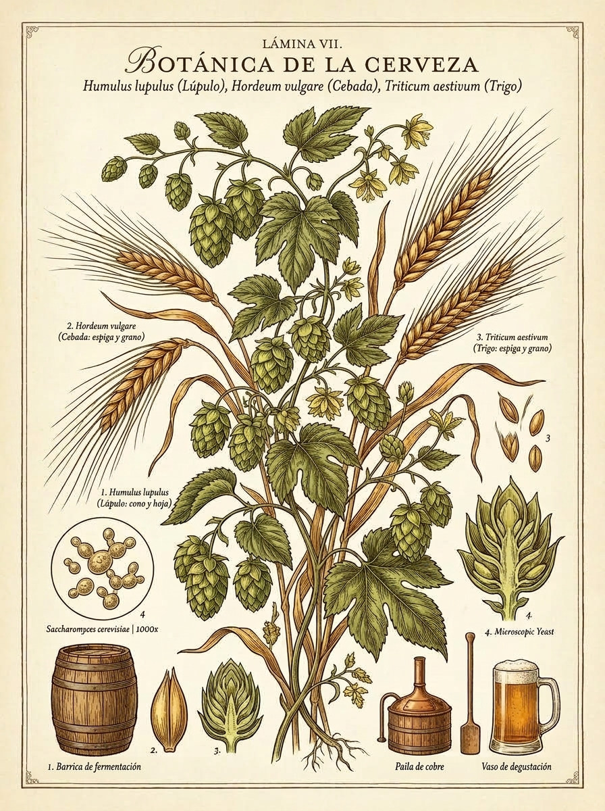

<!-- =======================================================================
     HERO EDITORIAL & INTRODUCCIÓN
     ======================================================================= -->
::: {.web-hero}
::: {.hero-badge}
Guía Botánica, Microbiológica &amp; Sensorial
:::

# Cultura Chelera

### El mapa interactivo de familias, levaduras, cereales y estilos cerveceros

::: {.hero-cover-container}
{.hero-cover-image alt="Ilustración botánica de lúpulo, cebada y trigo"}
:::

::: {.hero-meta-chips}
::: {.meta-chip}
🔬 **3 Familias** (*Lager, Ale, Espontánea*)
:::
::: {.meta-chip}
🌾 **Cereales** (*Malteados vs. Crudos*)
:::
::: {.meta-chip}
🍷 [**Cristalería**](#sec-cristaleria)
:::
::: {.meta-chip}
📚 [**Catálogo de Estilos**](assets/catalogo.html)
:::
::: {.meta-chip}
📋 [**Bitácora de Cata**](assets/degustacion.html)
:::
:::
:::

<!-- =======================================================================
     BARRA DE FILTROS PEGAJOSA (STICKY THUMB-BAR)
     Optimizada para navegación rápida con el pulgar en móviles
     ======================================================================= -->
::: {.sticky-filter-bar}
::: {.filter-scroll-wrapper}
<button type="button" class="filter-pill active" data-filter="all">🌐 Ver Todo</button>
<button type="button" class="filter-pill" data-filter="lager">❄️ Lager</button>
<button type="button" class="filter-pill" data-filter="ale">🌾 Ale</button>
<button type="button" class="filter-pill" data-filter="wild">🍇 Espontánea</button>
<button type="button" class="filter-pill" data-filter="cereales">🌾 Cereales &amp; Grano</button>
<button type="button" class="filter-pill" data-filter="cristaleria">🍷 Cristalería</button>
<button type="button" class="filter-pill" data-filter="glosario">📖 Glosario</button>
:::
:::

<!-- =======================================================================
     CONTENEDOR PRINCIPAL FLUIDO
     ======================================================================= -->
:::: {.web-container}

<!-- SECCIÓN 1: FUNDAMENTOS Y FAMILIAS DE FERMENTACIÓN -->
::: {.web-section id="sec-familias"}
::: {.section-header}
[Microbiología &amp; Temperatura]{.section-tag}

## Las Tres Grandes Familias de Fermentación

La clasificación cardinal de la cerveza no depende del color ni del amargor, sino de la **especie de levadura** y la **dinámica térmica** de fermentación.
:::

::: {.cards-grid-3}

<!-- TARJETA LAGER -->
::: {.family-card-web .card-lager data-category="lager"}
::: {.card-header-badge}
❄️ Familia Lager [7 °C – 13 °C]{.temp-pill}
:::

### Fermentación Baja

[*Saccharomyces pastorianus* (fondo del tanque)]{.scientific-name}

Las levaduras trabajan lentamente a bajas temperaturas y decantan al fondo. Requiere una maduración prolongada en frío (*lagering* durante semanas o meses) que redondea el perfil.

::: {.card-profile}
**Perfil Sensorial:** Sumamente limpio, seco, nítido y refrescante. Cero o mínimos ésteres frutales; protagonismo absoluto del cereal malteado y los lúpulos nobles.
:::

::: {.card-styles-list}
**Estilos Emblemáticos:**

- **Pilsner / Bohemian Pils:** Dorada brillante, amargor floral y especiado ([Saaz]).
- **Munich Helles:** Rubia pálida, acento en pan blanco y cereal dulce.
- **Dunkel / Schwarzbier:** Color tostado/negro pero cuerpo ligero y notas a corteza de pan.
- **Doppelbock:** Robusta, maltosa, notas a caramelo y frutos secos.
:::

::: {.card-glass-hint}
🍷 **Servicio ideal:** [Vaso Pilsner / Flauta](assets/catalogo.html) (favorece la efervescencia y retención de espuma blanca).
:::
:::

<!-- TARJETA ALE -->
::: {.family-card-web .card-ale data-category="ale"}
::: {.card-header-badge}
🌾 Familia Ale [15 °C – 24 °C]{.temp-pill}
:::

### Fermentación Alta

[*Saccharomyces cerevisiae* (superficie del tanque)]{.scientific-name}

Las levaduras suben a la superficie formando una densa corona de espuma durante su enérgica fermentación. Proceso más rápido y a temperatura ambiente moderada.

::: {.card-profile}
**Perfil Sensorial:** Expresivo y frutal. Las levaduras sintetizan ésteres (aromas a plátano, manzana, pera) y fenoles (clavo de olor, pimienta), combinados con generosas adiciones de malta y lúpulo.
:::

::: {.card-styles-list}
**Estilos Emblemáticos:**

- **Pale Ale / APA:** Ámbar claro, aromas cítricos, resinosos y herbales.
- **IPA (India Pale Ale):** Explosión lupulada, amargor punzante y notas tropicales.
- **Cervezas de Trigo (Weissbier / Witbier):** Sedosas, turbias, notas a plátano y clavo.
- **Porter &amp; Stout:** Maltas torrefactas, chocolate amargo, café y avena.
- **Abadía Belga (Dubbel / Tripel):** Fruta madura, especias, calidez alcohólica.
:::

::: {.card-glass-hint}
🍷 **Servicio ideal:** [Pinta Nonic, Vaso Weizen o Copa Tulipa](assets/catalogo.html).
:::
:::

<!-- TARJETA ESPONTÁNEA -->
::: {.family-card-web .card-wild data-category="wild"}
::: {.card-header-badge}
🍇 Espontánea &amp; Mixta [Ambiente / Barrica]{.temp-pill}
:::

### Fermentación Salvaje &amp; Rústica

[*Brettanomyces*, *Lactobacillus*, *Pediococcus* y microflora]{.scientific-name}

El mosto se expone al aire nocturno en piscinas abiertas (*koelschip*) en el valle del río Senne (Bélgica) o se inocula con cultivos mixtos. Madura durante meses o años en toneles de roble.

::: {.card-profile}
**Perfil Sensorial:** Complejo, ácido, seco y agreste. Marcada acidez láctica/acética, notas terrosas, cuero mojado, establo (*barnyard funk*) y madera añeja.
:::

::: {.card-styles-list}
**Estilos Emblemáticos:**

- **Lambic Tradicional:** Plana (sin gas), ácida y rústica directa de barrica.
- **Gueuze:** Mezcla magistral de lambics de 1, 2 y 3 años con segunda fermentación en botella.
- **Fruit Lambic (Kriek / Framboise):** Maceración prolongada con cerezas ácidas o frambuesas.
- **Gose &amp; Berliner Weisse:** Trigo ácido, refrescante, con notas salinas o cilantro.
:::

::: {.card-glass-hint}
🍷 **Servicio ideal:** [Copa Tulipa o Cáliz Belga](assets/catalogo.html) (oxigena y resalta la acidez noble).
:::
:::

:::
:::

<!-- SECCIÓN 2: BOTÁNICA Y BIOQUÍMICA DE CEREALES -->
::: {.web-section id="sec-cereales" data-category="cereales"}
::: {.section-header}
[Botánica Agraria &amp; Enzimología]{.section-tag}

## Bioquímica de Cereales: Malteado vs. Grano Crudo

El grano es el corazón azucarado y proteico de la cerveza. Entender la diferencia entre la **germinación enzimática (malteado)** y el **uso de grano crudo** es la clave para comprender la textura y cuerpo de cada estilo.
:::

::: {.cards-grid-2}

<!-- TARJETA CEREAL MALTEADO -->
::: {.grain-card .malt-focus}
### 🌾 Grano Malteado (Cebada / Trigo)
#### *Hordeum vulgare* / *Triticum aestivum*

::: {.grain-process}
**El Proceso:** Remojo en agua $\rightarrow$ Germinación controlada $\rightarrow$ Secado/Tostado en horno.
:::

::: {.grain-mechanisms}

- **Activación Enzimática:** La germinación despierta las enzimas amilasas ($\alpha$ y $\beta$).
- **Conversión de Almidón:** Durante la maceración en caliente (64–68 °C), las amilasas rompen las largas cadenas de almidón insoluble y las transforman en **maltosa y azúcares fermentables** para la levadura.
- **Poder Diastásico:** La malta base proporciona la potencia enzimática necesaria para convertir todo el mosto.
:::
:::

<!-- TARJETA GRANO CRUDO / SIN MALTEAR -->
::: {.grain-card .raw-focus}
### 🌾 Grano Sin Maltear (Crudo / Copos)
#### Trigo no malteado, Avena cruda, Maíz, Centeno

::: {.grain-process}
**El Proceso:** Grano cosechado directamente o pre-gelatinizado en copos sin pasar por maltería.
:::

::: {.grain-mechanisms}

- **Cero Enzimas Activas:** Al no haber germinado, carece de amilasas propias; **requiere combinarse obligatoriamente con malta base** de alto poder diastásico.
- **Aporte de Proteínas y Betaglucanos:** Mantiene sus proteínas solubles intactas, lo que confiere la **turbidez característica** y una **textura aterciopelada y cremosa**.
- **Retención de Espuma:** Indispensable en estilos históricos como la **Witbier belga** (hasta 50% de trigo crudo), **Lambic tradicional** (30–40% de trigo crudo) y las sedosas **Oatmeal Stouts**.
:::
:::

:::

::: {.botanical-quote}
*"El maltero crea el azúcar que alimenta la vida microbiana; el grano crudo esculpe la sedosidad y el manto de espuma que acaricia el paladar."*
:::
:::

<!-- SECCIÓN 3: CRISTALERÍA Y ARTE DEL SERVICIO -->
::: {.web-section id="sec-cristaleria" data-category="cristaleria"}
::: {.section-header}
[Geometría &amp; Termodinámica]{.section-tag}

## Cristalería: La Forma al Servicio del Aroma

Cada estilo cervecero exige una geometría específica para regular la temperatura de servicio, canalizar los compuestos volátiles aromáticos hacia la nariz y preservar la corona de espuma.
:::

::: {.glassware-web-grid}

::: {.glass-card-web data-glass="pilsner" data-category="lager"}
::: {.glass-svg-wrap}
{.glass-svg alt="Vaso Pilsner"}
:::
#### Vaso Pilsner / Flauta
**Estilos:** *Pilsner, Helles, Kolsch, Pale Lager*

**Propósito:** Su silueta cónica alta y esbelta resalta la claridad brillante dorada y concentra el flujo continuo de burbujas de $\text{CO}_2$, manteniendo una espuma densa y blanca.
:::

::: {.glass-card-web data-glass="nonic" data-category="ale lager"}
::: {.glass-svg-wrap}
{.glass-svg alt="Pinta Nonic"}
:::
#### Pinta Nonic / Imperial
**Estilos:** *Pale Ale, IPA, Amber Ale, Stout, Porter*

**Propósito:** El ensanchamiento superior mejora el agarre, evita que los bordes se despostillen y permite beber cómodamente cervezas de trago largo con moderada carbonatación.
:::

::: {.glass-card-web data-glass="weizen" data-category="ale wild"}
::: {.glass-svg-wrap}
{.glass-svg alt="Vaso Weizen"}
:::
#### Vaso Weizen (Trigo)
**Estilos:** *Hefeweizen, Dunkelweizen, Witbier, Gose*

**Propósito:** Base estrecha y boca acampanada con gran volumen (500 ml) para albergar la exuberante corona de espuma de trigo y liberar los aromas a plátano y clavo.
:::

::: {.glass-card-web data-glass="tulip" data-category="wild ale"}
::: {.glass-svg-wrap}
{.glass-svg alt="Copa Tulipa"}
:::
#### Copa Tulipa / Cáliz
**Estilos:** *Belgian Tripel, Saison, Lambic, Gueuze, Imperial Stout*

**Propósito:** Su cuerpo abombado concentra los ésteres complejos y el labio evertido dirige el líquido hacia la parte frontal y lateral de la lengua, realzando la frescura y los aromas nobles.
:::

:::
:::

<!-- SECCIÓN 4: GLOSARIO TÉCNICO & SENSORIAL -->
::: {.web-section id="sec-glosario"}
::: {.section-header}
[Terminología Cervecera &amp; Sensorial]{.section-tag}

## Glosario Técnico y de Cata

Conceptos bioquímicos fundamentales, ingredientes clave, procesos de estabilización y descriptores sensoriales no tan comunes para enriquecer la experiencia de degustación.
:::

::: {.glossary-controls}
::: {.glossary-search-wrapper}
🔍
<input type="text" id="glossary-search" class="glossary-search-input" placeholder="Buscar término (ej. malta, lúpulo, astringencia, diacetilo...)" aria-label="Buscar en el glosario">
:::

::: {.glossary-categories-filter}
<button type="button" class="glossary-tab-btn active" data-tab="all">✨ Todos</button>
<button type="button" class="glossary-tab-btn" data-tab="materia">🌾 Ingredientes &amp; Mosto</button>
<button type="button" class="glossary-tab-btn" data-tab="proceso">⚙️ Procesos &amp; Estabilidad</button>
<button type="button" class="glossary-tab-btn" data-tab="degustacion">👅 Cata &amp; Sensaciones</button>
:::
:::

::: {.glossary-grid}

<!-- CEBADA DE DOS CARRERAS -->
::: {.glossary-card data-glossary-cat="materia"}
::: {.glossary-card-header}
::: {.glossary-title-row}
### Cebada de Dos Carreras {.glossary-title}
[*Hordeum vulgare subsp. distichum* • Cebada dística (2-Row Barley)]{.glossary-phonetic}
:::
::: {.glossary-def-row}
::: {.glossary-def-text}
Variedad botánica de cebada donde solo la espiguilla central del raquis es fértil, produciendo espigas con dos hileras de granos grandes, simétricos y uniformes.
:::
::: {.glossary-type-tag}
[🌾 Grano &amp; Cereal]{.glossary-tag .tag-materia}
:::
:::
:::
::: {.glossary-card-body}
::: {.glossary-detail-box}
::: {.glossary-detail-title}
🔬 Ventajas Bioquímicas vs. Seis Carreras (6-Row)
:::
Posee mayor proporción de almidón extraíble y menor porcentaje de cáscara por peso. Al contener menos proteínas y taninos que la variedad de seis carreras, minimiza la astringencia y la turbidez por frío (*chill haze*), aportando un poder enzimático ideal para recetas 100% malta.
:::

::: {.glossary-detail-box}
::: {.glossary-detail-title}
👅 Perfil Sensorial y de Elaboración
:::
Estándar predilecto para Pilsners europeas, cervezas alemanas, británicas y artesanales de alta calidad. Otorga mostos muy limpios con notas profundas y elegantes a pan horneado fresco, galleta dulce, cereal noble y final redondo sin asperezas.
:::
:::
:::

<!-- MALTA -->
::: {.glossary-card data-glossary-cat="materia"}
::: {.glossary-card-header}
::: {.glossary-title-row}
### Malta {.glossary-title}
[Cereal germinado y tostado • *Malt*]{.glossary-phonetic}
:::
::: {.glossary-def-row}
::: {.glossary-def-text}
Granos de cereal (principalmente cebada o trigo) sometidos a germinación controlada y secado/tostado en horno.
:::
::: {.glossary-type-tag}
[🌾 Ingrediente]{.glossary-tag .tag-materia}
:::
:::
:::
::: {.glossary-card-body}
::: {.glossary-detail-box}
::: {.glossary-detail-title}
🔬 Usos y Efectos en la Cerveza
:::
Aporta las enzimas amilasas ($\alpha$ y $\beta$) que transforman el almidón en azúcares fermentables consumidos por la levadura, y dextrinas que construyen el cuerpo de la bebida.
:::

::: {.glossary-detail-box}
::: {.glossary-detail-title}
👅 Impacto en Sabor y Color
:::
Determina el color (escala SRM desde pajizo brillante hasta negro opaco). Según su nivel de tostado, confiere sabores que van desde pan fresco, galleta y cereal dulce, hasta caramelo, toffee, frutos secos, chocolate amargo y café torrefacto.
:::
:::
:::

<!-- MOSTO -->
::: {.glossary-card data-glossary-cat="materia"}
::: {.glossary-card-header}
::: {.glossary-title-row}
### Mosto {.glossary-title}
[Infusión azucarada no fermentada • *Wort*]{.glossary-phonetic}
:::
::: {.glossary-def-row}
::: {.glossary-def-text}
Líquido denso y dulce obtenido tras macerar los granos molidos en agua caliente (64–68 °C) y separar el bagazo sólido en la cuba de filtrado.
:::
::: {.glossary-type-tag}
[🌾 Mosto Base]{.glossary-tag .tag-materia}
:::
:::
:::
::: {.glossary-card-body}
::: {.glossary-detail-box}
::: {.glossary-detail-title}
🔬 Usos y Efectos en la Cerveza
:::
Es el medio de cultivo nutritivo que alimentará a la levadura. Durante su posterior ebullición en la olla, se añade el lúpulo, se esteriliza la mezcla y se precipitan proteínas indeseables.
:::

::: {.glossary-detail-box}
::: {.glossary-detail-title}
👅 Impacto en Sabor y Graduación
:::
Su concentración de azúcares disueltos (Gravedad Original u *OG*) define el grado alcohólico potencial (ABV) y la densidad de azúcares residuales no fermentables que darán plenitud al paladar.
:::
:::
:::

<!-- LÚPULO -->
::: {.glossary-card data-glossary-cat="materia"}
::: {.glossary-card-header}
::: {.glossary-title-row}
### Lúpulo {.glossary-title}
[*Humulus lupulus* • Conos y Glándulas de Lupulina]{.glossary-phonetic}
:::
::: {.glossary-def-row}
::: {.glossary-def-text}
Flores o conos femeninos de la planta trepadora cannabácea *Humulus lupulus*, cuyas glándulas doradas (lupulina) aportan alfa-ácidos y aceites esenciales.
:::
::: {.glossary-type-tag}
[🌿 Lúpulo]{.glossary-tag .tag-materia}
:::
:::
:::
::: {.glossary-card-body}
::: {.glossary-detail-box}
::: {.glossary-detail-title}
🔬 Usos y Efectos en la Cerveza
:::

- **Amargor:** Isomerización de alfa-ácidos durante el hervor prolongado.
- **Aroma y Sabor:** Adición tardía en hervor o en frío (*dry hopping*).
- **Estabilidad y Espuma:** Actúa como conservante antibacteriano natural frente a bacterias gram-positivas y estabiliza la tensión superficial de la espuma.
:::

::: {.glossary-detail-box}
::: {.glossary-detail-title}
👅 Impacto en Sabor y Sensación
:::
Equilibra el dulzor de la malta mediante un amargor refrescante medido en IBUs. Despliega un abanico aromático: cítricos (pomelo, mandarina), resinosos (pino), florales, herbales o frutas tropicales (maracuyá, mango).
:::
:::
:::

<!-- ABV -->
::: {.glossary-card data-glossary-cat="proceso"}
::: {.glossary-card-header}
::: {.glossary-title-row}
### ABV {.glossary-title}
[Graduación alcohólica en volumen • *Alcohol by Volume*]{.glossary-phonetic}
:::
::: {.glossary-def-row}
::: {.glossary-def-text}
Porcentaje en volumen (% vol) que mide la concentración de etanol puro contenido en 100 ml de cerveza a 20 °C.
:::
::: {.glossary-type-tag}
[⚙️ Parámetro]{.glossary-tag .tag-proceso}
:::
:::
:::
::: {.glossary-card-body}
::: {.glossary-detail-box .box-proceso}
::: {.glossary-detail-title}
🔬 Cálculo & Dinámica Bioquímica
:::
Resulta de la fermentación donde las levaduras consumen azúcares del mosto generando alcohol y $\text{CO}_2$. Se determina mediante el diferencial de densidades:

$$\text{ABV} \approx (\text{OG} - \text{FG}) \times 131.25$$
:::

::: {.glossary-detail-box .box-proceso}
::: {.glossary-detail-title}
👅 Impacto en Sensación, Cuerpo y Sabor
:::

- **Cuerpo y Densidad:** El alcohol incrementa la viscosidad y la plenitud en el paladar (*mouthfeel*).
- **Calidez y Aroma:** Aporta una agradable calidez en garganta (típica en *Imperial Stout*, *Belgian Tripel* o *Barleywine*) y potencia la volatilización aromática de ésteres y lúpulo.
- **Balance:** Equilibra el dulzor de las maltas especiales y suaviza el amargor punzante.
:::
:::
:::

<!-- PASTERIZACIÓN -->
::: {.glossary-card data-glossary-cat="proceso"}
::: {.glossary-card-header}
::: {.glossary-title-row}
### Pasterización {.glossary-title}
[Tratamiento térmico de conservación • *Pasteurization*]{.glossary-phonetic}
:::
::: {.glossary-def-row}
::: {.glossary-def-text}
Proceso térmico controlado (flash a ~72 °C durante 15–30 segundos o en túnel a ~60–65 °C sobre envases) para inactivar levaduras y bacterias.
:::
::: {.glossary-type-tag}
[⚙️ Estabilidad]{.glossary-tag .tag-proceso}
:::
:::
:::
::: {.glossary-card-body}
::: {.glossary-detail-box .box-proceso}
::: {.glossary-detail-title}
🔬 Usos y Efectos en la Cerveza
:::
Garantiza la estabilidad biológica prolongada, detiene cualquier fermentación secundaria indeseada y permite almacenar y distribuir la cerveza a temperatura ambiente durante meses sin riesgo de degradación microbiana.
:::

::: {.glossary-detail-box .box-proceso}
::: {.glossary-detail-title}
👅 Impacto en Sabor y Frescura
:::
Asegura consistencia comercial masiva; sin embargo, el choque térmico puede volatilizar los aceites más sutiles y delicados del lúpulo fresco y acelerar ligeras notas de envejecimiento térmico respecto a una cerveza fresca sin pasterizar.
:::
:::
:::

<!-- MICROFILTRACIÓN -->
::: {.glossary-card data-glossary-cat="proceso"}
::: {.glossary-card-header}
::: {.glossary-title-row}
### Microfiltración {.glossary-title}
[Esterilización en frío por membrana • *Cold Filtering*]{.glossary-phonetic}
:::
::: {.glossary-def-row}
::: {.glossary-def-text}
Filtración física en frío con membranas micrométricas (0.2 a 0.45 micras) capaces de retener mecánicamente células de levadura y bacterias.
:::
::: {.glossary-type-tag}
[⚙️ Filtrado en Frío]{.glossary-tag .tag-proceso}
:::
:::
:::
::: {.glossary-card-body}
::: {.glossary-detail-box .box-proceso}
::: {.glossary-detail-title}
🔬 Usos y Efectos en la Cerveza
:::
Logra estabilidad microbiológica y un brillo visual cristalino sin necesidad de someter el producto al estrés del calor. Es el método predilecto para cervezas embotelladas tipo *draft/barril*.
:::

::: {.glossary-detail-box .box-proceso}
::: {.glossary-detail-title}
👅 Impacto en Sabor y Frescura
:::
Preserva intactos los compuestos volátiles termolábiles: los aceites aromáticos del lúpulo, las notas frescas del cereal y los ésteres frutales, manteniendo una sensación en boca sumamente nítida, vivaz y pura.
:::
:::
:::

<!-- ASTRINGENCIA -->
::: {.glossary-card data-glossary-cat="degustacion"}
::: {.glossary-card-header}
::: {.glossary-title-row}
### Astringencia {.glossary-title}
[Sensación táctil de sequedad y aspereza]{.glossary-phonetic}
:::
::: {.glossary-def-row}
::: {.glossary-def-text}
Sensación mecánica bucal (no un sabor) caracterizada por tirantez y sequedad en encías y lengua, similar a morder la piel de una uva verde.
:::
::: {.glossary-type-tag}
[👅 Sensación Boca]{.glossary-tag .tag-degustacion}
:::
:::
:::
::: {.glossary-card-body}
::: {.glossary-detail-box .box-degustacion}
::: {.glossary-detail-title}
🔬 Origen Bioquímico
:::
Causada por la precipitación de proteínas salivales al unirse con polifenoles o taninos extraídos de la cáscara del grano (por moler en exceso, recircular a más de 78 °C o pH de maceración alcalino) o por exceso vegetal de lúpulo.
:::

::: {.glossary-detail-box .box-degustacion}
::: {.glossary-detail-title}
👅 Impacto en la Degustación
:::
En niveles mínimos puede otorgar cierta estructura en cervezas añejadas en barrica de roble; en exceso se considera un defecto que deja el paladar áspero, seco y fatigado.
:::
:::
:::

<!-- SENSIBILIDAD EN BOCA / MOUTHFEEL -->
::: {.glossary-card data-glossary-cat="degustacion"}
::: {.glossary-card-header}
::: {.glossary-title-row}
### Sensación en Boca (*Mouthfeel*) {.glossary-title}
[Cuerpo, viscosidad y textura táctil]{.glossary-phonetic}
:::
::: {.glossary-def-row}
::: {.glossary-def-text}
Conjunto de sensaciones físicas no gustativas percibidas en boca: peso, densidad, viscosidad, temperatura y efervescencia.
:::
::: {.glossary-type-tag}
[👅 Textura]{.glossary-tag .tag-degustacion}
:::
:::
:::
::: {.glossary-card-body}
::: {.glossary-detail-box .box-degustacion}
::: {.glossary-detail-title}
🔬 Origen Bioquímico
:::
Regulada por la presencia de dextrinas (azúcares no fermentables), proteínas de cadena larga y betaglucanos (aportados por trigo crudo o avena), nivel de $\text{CO}_2$ disuelto y contenido de alcohol.
:::

::: {.glossary-detail-box .box-degustacion}
::: {.glossary-detail-title}
👅 Perfil en Copa
:::
Abarca desde una textura ligera y crujiente (*crisp*, típica de Pilsner), pasando por un cuerpo sedoso y aterciopelado (Witbier, Hazy IPA), hasta una sensación cremosa, untuosa y masticable (Oatmeal Stout, Barleywine).
:::
:::
:::

<!-- ÉSTERES -->
::: {.glossary-card data-glossary-cat="degustacion"}
::: {.glossary-card-header}
::: {.glossary-title-row}
### Ésteres (Perfil Afrutado) {.glossary-title}
[Compuestos aromáticos frutales • *Esters*]{.glossary-phonetic}
:::
::: {.glossary-def-row}
::: {.glossary-def-text}
Moléculas aromáticas producidas durante la fermentación cuando la levadura combina ácidos grasos con alcoholes orgánicos.
:::
::: {.glossary-type-tag}
[👃 Aroma &amp; Sabor]{.glossary-tag .tag-degustacion}
:::
:::
:::
::: {.glossary-card-body}
::: {.glossary-detail-box .box-degustacion}
::: {.glossary-detail-title}
🔬 Origen & Dinámica
:::
Su síntesis se maximiza a temperaturas más cálidas (18–24 °C), por lo que son el rasgo emblemático de las levaduras Ale (*S. cerevisiae*) y de fermentación salvaje.
:::

::: {.glossary-detail-box .box-degustacion}
::: {.glossary-detail-title}
👅 Descriptores Sensoriales
:::

- **Acetato de isoamilo:** Aroma a plátano maduro / chicle (clásico en *Hefeweizen*).
- **Acetato de etilo:** Notas a manzana verde ligera o pera en dosis sutiles.
- **Ésteres oscuros:** Ciruela pasa, higo y uva pasa en cervezas Belgas de Abadía (*Dubbel*, *Quadrupel*).
:::
:::
:::

<!-- FENOLES -->
::: {.glossary-card data-glossary-cat="degustacion"}
::: {.glossary-card-header}
::: {.glossary-title-row}
### Fenoles (Perfil Especiado &amp; Ahumado) {.glossary-title}
[Compuestos aromáticos complejos • *Phenols*]{.glossary-phonetic}
:::
::: {.glossary-def-row}
::: {.glossary-def-text}
Compuestos aromáticos sintetizados por cepas de levadura POF+ (*Phenolic Off-Flavor Positive*) o derivados de maltas ahumadas.
:::
::: {.glossary-type-tag}
[👃 Aroma &amp; Sabor]{.glossary-tag .tag-degustacion}
:::
:::
:::
::: {.glossary-card-body}
::: {.glossary-detail-box .box-degustacion}
::: {.glossary-detail-title}
🔬 Origen & Levaduras
:::
A diferencia de las Lagers limpias donde indicarían contaminación, en estilos tradicionales belgas y alemanes de trigo son una virtud química deseada y controlada.
:::

::: {.glossary-detail-box .box-degustacion}
::: {.glossary-detail-title}
👅 Descriptores Sensoriales
:::

- **4-vinil-guayacol (4-VG):** Intenso aroma a clavo de olor y nuez moscada (típico en trigo bávaro).
- **Fenoles especiados:** Pimienta blanca, cardamomo y semillas de cilantro (Saison y Belgian Tripel).
- **Guayacol / Eugenol:** Notas a humo de madera noble, tocino o turba (Rauchbier alemana).
:::
:::
:::

<!-- DIACETILO -->
::: {.glossary-card data-glossary-cat="degustacion"}
::: {.glossary-card-header}
::: {.glossary-title-row}
### Diacetilo {.glossary-title}
[Perfil mantecoso • *Diacetyl* (2,3-butanodiona)]{.glossary-phonetic}
:::
::: {.glossary-def-row}
::: {.glossary-def-text}
Compuesto volátil producido naturalmente por la levadura al fermentar a partir del precursor alfa-acetolactato.
:::
::: {.glossary-type-tag}
[⚠️ Defecto / Umbral]{.glossary-tag .tag-degustacion}
:::
:::
:::
::: {.glossary-card-body}
::: {.glossary-detail-box .box-degustacion}
::: {.glossary-detail-title}
🔬 Dinámica de Maduración
:::
Una levadura sana reabsorbe y descompone el diacetilo al final de la fermentación si se le permite un "descanso de diacetilo" con un suave incremento térmico previo al enfriamiento final.
:::

::: {.glossary-detail-box .box-degustacion}
::: {.glossary-detail-title}
👅 Perfil Sensorial: ¿Defecto o Estilo?
:::
Evoca sabor y aroma a mantequilla derretida, palomitas de cine o caramelo toffee grasoso con una película resbalosa en lengua. Es un defecto grave en Lagers modernas; no obstante, se aceptan trazas casi imperceptibles en ciertas Ales tradicionales británicas o Pilsners checas históricas.
:::
:::
:::

<!-- DMS -->
::: {.glossary-card data-glossary-cat="degustacion"}
::: {.glossary-card-header}
::: {.glossary-title-row}
### DMS (Sulfuro de Dimetilo) {.glossary-title}
[Compuesto azufrado volátil • *Dimethyl Sulfide*]{.glossary-phonetic}
:::
::: {.glossary-def-row}
::: {.glossary-def-text}
Compuesto químico orgánico de azufre generado por descomposición térmica de la SMM en maltas poco tostadas (como Pilsner).
:::
::: {.glossary-type-tag}
[⚠️ Defecto]{.glossary-tag .tag-degustacion}
:::
:::
:::
::: {.glossary-card-body}
::: {.glossary-detail-box .box-degustacion}
::: {.glossary-detail-title}
🔬 Control en Fábrica
:::
Es muy volátil: se elimina evaporándolo mediante un hervor vigoroso en olla abierta (mínimo 60–90 min) y un enfriamiento súbito del mosto para evitar que se regenere en caliente.
:::

::: {.glossary-detail-box .box-degustacion}
::: {.glossary-detail-title}
👅 Impacto en Cata
:::
Aporta un aroma y sabor inconfundible a maíz dulce enlatado, verduras cocidas (col, apio) o caldo de mariscos. En cervezas rubias muy ligeras se toleran cantidades ínfimas, pero si es perceptible con facilidad arruina la frescura del trago.
:::
:::
:::

:::

::: {#glossary-empty .glossary-empty-state}
🔍 No se encontraron términos que coincidan con la búsqueda o filtro seleccionado.
:::

:::

<!-- SECCIÓN 5: RECURSOS INTERACTIVOS Y DESCARGAS -->
::: {.web-section id="sec-recursos"}
::: {.section-header}
[Herramientas del Proyecto]{.section-tag}

## Explora el Ecosistema Cervecero
:::

::: {.tools-grid}

::: {.tool-card}
[📋]{.tool-icon}

### Bitácora de Cata Interactiva
Registra tus notas de degustación sensorial (apariencia, aroma, sabor, balance y puntuación BJCP). Funciona offline con almacenamiento local y exportación a PDF.

[Abrir Bitácora de Cata →](assets/degustacion.html){.btn-tool}
:::

::: {.tool-card}
[📚]{.tool-icon}

### Catálogo de Estilos
Explora fichas detalladas de estilos internacionales con parámetros técnicos (IBU, ABV, SRM), maridajes y cristalería.

[Ver Catálogo de Cervezas →](assets/catalogo.html){.btn-tool}
:::

::: {.tool-card}
[🖨️]{.tool-icon}

### Díptico de Colección (PDF)
¿Prefieres el folleto editorial clásico de dos paneles para imprimir en tamaño carta dúplex? Consulta la versión original maquetada para papel.

[Ver Díptico Imprimible →](diptico.html){.btn-tool}
:::

:::
:::

::::

<!-- =======================================================================
     BARRA INFERIOR DE ACCIÓN RÁPIDA (MOBILE DOCK)
     ======================================================================= -->
::: {.mobile-quick-dock}
[🍺 Guía](#sec-familias){.dock-item}
[🌾 Grano](#sec-cereales){.dock-item}
[🍷 Copas](#sec-cristaleria){.dock-item}
[📖 Glosario](#sec-glosario){.dock-item}
[📋 Cata](assets/degustacion.html){.dock-item}
[📚 Estilos](assets/catalogo.html){.dock-item}
:::

